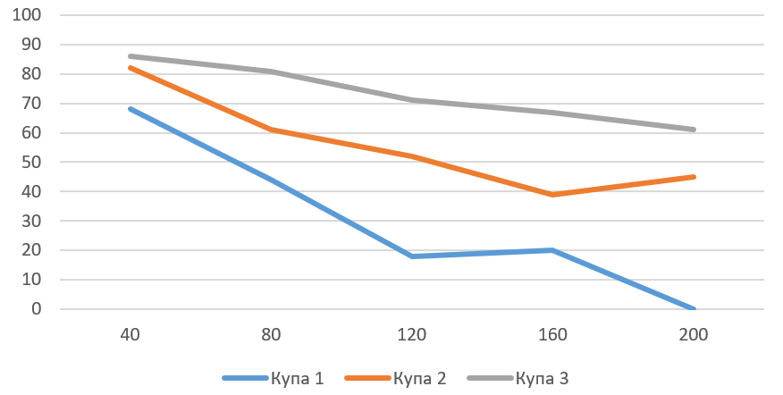
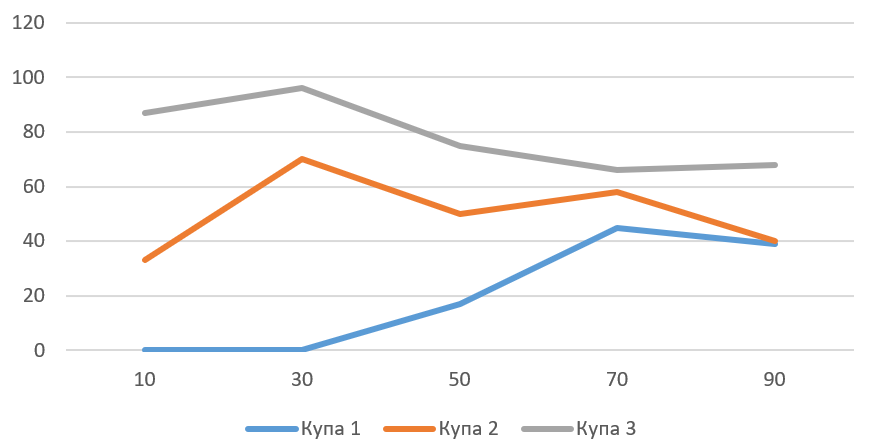
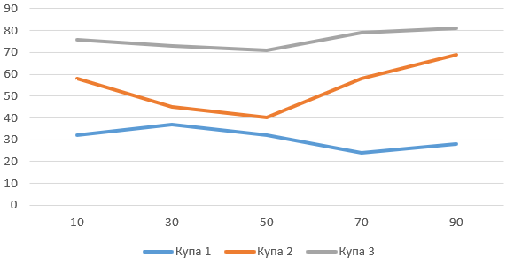

## Комп'ютерні системи імітаційного моделювання
## СПм-23-4, **Кононенко Анастасія Ігорівна**
### Лабораторна робота №**1**. Опис імітаційних моделей та проведення обчислювальних експериментів

 

### Варіант 10, модель у середовищі NetLogo:
[Ants](http://www.netlogoweb.org/launch#http://www.netlogoweb.org/assets/modelslib/Sample%20Models/Biology/Ants.nlogo)

 

### Вербальний опис моделі:
Симуляція колонії мурах, які шукають їжу. Кожна мураха моделюється агентом, який дотримується простого набору правил: коли мураха знаходить шматок їжі, вона несе їжу назад у гніздо, кидаючи хімікат під час руху. Коли інші мурахи «нюхають» хімікат, вони слідують за хімікатом до їжі.

### Керуючі параметри:
- **POPULATION** визначає кількість агентів у середовищі моделювання, тобто, в даній моделі, кількість мурах у колоонії.
- **EVAPORATION-RATE** визначає швидкість випаровування феромонів.
- **DIFFUSION-RATE** швидкість дифузії (поширення) феромонів по території.

### Внутрішні параметри:
- **chemical**. Кількість хімічного сліду (феромонів) на ділянці.
- **food**. Кількість їжі на ділянці (0, 1 або 2).
- **nest?**. Позначка, що показує, чи є ділянка частиною гнізда (true/false).
- **nest-scent**. Значення, що показує близькість патчу до гнізда (чим більше значення, тим ближче до гнізда).
- **food-source-number**. Номер джерела їжі (1, 2 або 3) для ідентифікації різних місць із їжею.

### Показники роботи системи:
- Кількість їжі на кожній з ділянок.

### Примітки:
Колонія мурах зазвичай використовує джерело їжі по порядку, починаючи з їжі, яка знаходиться найближче до гнізда, і закінчуючи їжею, що знаходиться найбільше від гнізда. 

### Недоліки моделі:
Модель не враховує деякі складні аспекти реальної поведінки мурах, наприклад, взаємодію між мурахами або вплив перешкод у середовищі.

 

## Обчислювальні експерименти
### 1. Вплив кількості мурах (POPULATION) на ефективність збору їжі
Досліджується залежність ефективність пошуку та збору їжі з трьох джерел (куч) протягом певної кількості тактів (500) від кількості мурах у колонії, зазначеного на початку симуляції.4Експерименти проводяться при 40-200 мурахах, з кроком 40, усього 5 симуляцій.  
Інші керуючі параметри мають значення за замовчуванням:
- **EVAPORATION-RATE**: 50
- **DIFFUSION-RATE**: 50

<table>
<thead>
<tr><th>Кількість мурах</th><th>Кількість їжі у кучі 1</th><th>Кількість їжі у кучі 2</th><th>Кількість їжі у кучі 3</th></tr>
</thead>
<tbody>
<tr><td>40</td><td>68</td><td>82</td><td>86</td></tr>
<tr><td>80</td><td>44</td><td>61</td><td>81</td></tr>
<tr><td>120</td><td>18</td><td>52</td><td>71</td></tr>
<tr><td>160</td><td>20</td><td>39</td><td>67</td></tr>
<tr><td>200</td><td>0</td><td>45</td><td>61</td></tr>
</tbody>
</table>

Графік наочно показує, що збільшення кількості мурах підвищує ефективність збору їжі з усіх джерел.

### 2. Вплив швидкості випаровування феромонів на ефективність пошуку їжі
Досліджується залежність ефективності збору їжі з трьох джерел (куч) протягом певної кількості тактів (500) від параметру DIFFUSION-RATE, зазначеного на початку симуляції.
Експерименти проводяться при 10-90 DIFFUSION-RATE, з кроком 20, усього 5 симуляцій.  
Інші керуючі параметри мають значення за замовчуванням:
- **POPULATION**: 100
- **EVAPORATION-RATE**: 50

<table>
<thead>
<tr><th>DIFFUSION-RATE</th><th>Кількість їжі у кучі 1</th><th>Кількість їжі у кучі 2</th><th>Кількість їжі у кучі 3</th></tr>
</thead>
<tbody>
<tr><td>10</td><td>0</td><td>33</td><td>87</td></tr>
<tr><td>30</td><td>0</td><td>70</td><td>96</td></tr>
<tr><td>50</td><td>17</td><td>50</td><td>75</td></tr>
<tr><td>70</td><td>45</td><td>58</td><td>66</td></tr>
<tr><td>90</td><td>39</td><td>40</td><td>68</td></tr>
</tbody>
</table>

Графік наочно показує, що збільшення швидкості випаровування феромонів (EVAPORATION-RATE) суттєво впливає на ефективність пошуку їжі. При низьких значеннях випаровування (10-30), феромони довше залишаються на шляху, що допомагає мурахам ефективніше знаходити дальні джерела їжі (особливо купу 3). Однак при значеннях EVAPORATION-RATE від 50 до 90, ефективність поступово знижується, оскільки феромони випаровуються швидше, що ускладнює мурашам координацію та пошук їжі, особливо з віддалених джерел.

### 3. Вплив швидкості дифузії феромонів на ефективність пошуку їжі
Досліджується залежність ефективності збору їжі з трьох джерел (куч) протягом певної кількості тактів (200) від параметру EVAPORATION-RATE, зазначеного на початку симуляції.
Експерименти проводяться при 10-90 EVAPORATION-RATE, з кроком 20, усього 5 симуляцій.  
Інші керуючі параметри мають значення за замовчуванням:
- **POPULATION**: 100
- **DIFFUSION-RATE**: 50

<table>
<thead>
<tr><th>EVAPORATION-RATE</th><th>Кількість їжі у кучі 1</th><th>Кількість їжі у кучі 2</th><th>Кількість їжі у кучі 3</th></tr>
</thead>
<tbody>
<tr><td>10</td><td>32</td><td>58</td><td>76</td></tr>
<tr><td>30</td><td>37</td><td>45</td><td>73</td></tr>
<tr><td>50</td><td>32</td><td>40</td><td>71</td></tr>
<tr><td>70</td><td>24</td><td>58</td><td>79</td></tr>
<tr><td>90</td><td>28</td><td>69</td><td>81</td></tr>
</tbody>
</table>

Графік наочно показує, що зміна швидкості дифузії феромонів має певний вплив на ефективність пошуку їжі. При значеннях EVAPORATION-RATE від 10 до 50, мурахи здатні ефективно збирати їжу з усіх трьох джерел. Однак при збільшенні EVAPORATION-RATE до 70-90 спостерігається стабілізація результатів: мурахи збирають більше їжі з найближчоЇ купи(1), але ефективність збору їжі з віддалених куп (2 і 3) дещо знижується, що може бути пов'язано зі швидшим поширенням феромонів і втратою концентрації на конкретних ділянках та точності шляху.